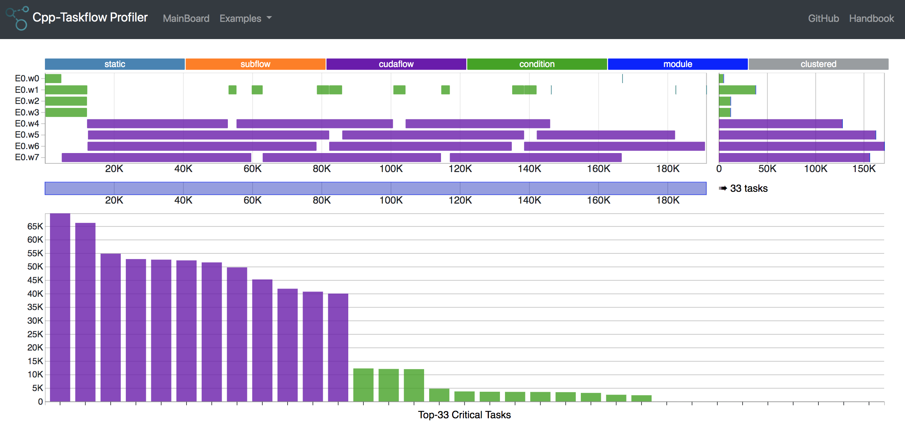

# TFProf

TFProf provides the visualization and tooling needed for profiling 
Taskflow programs 

# Profile Your Taskflow Program

Generate tfprof data (.tfp) from your [Taskflow][taskflow] program through the python script:

```bash
~$ python3 tfprof.py -o output.tfp /path/to/my/taskflow/program arg1 arg2
~$ cat output.tfp
[ ... JSON data ]
```

Paste the content of `output.tfp` to the bottom JSON text area at the following page:

<p align="center">
   <a href="https://taskflow.github.io/tfprof/">
     
   </a>
</p>

You may also open [index.html](index.html) from your browser to visualize tfprof data.


---

[taskflow]:    https://github.com/taskflow/taskflow
